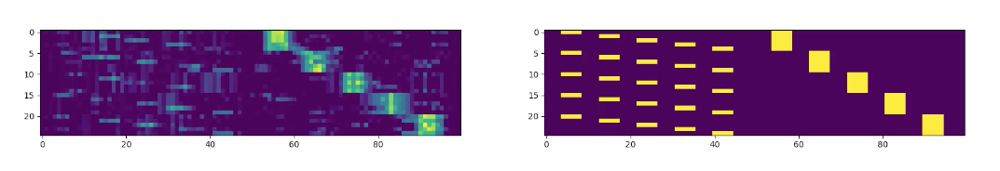
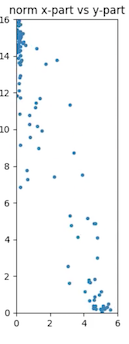
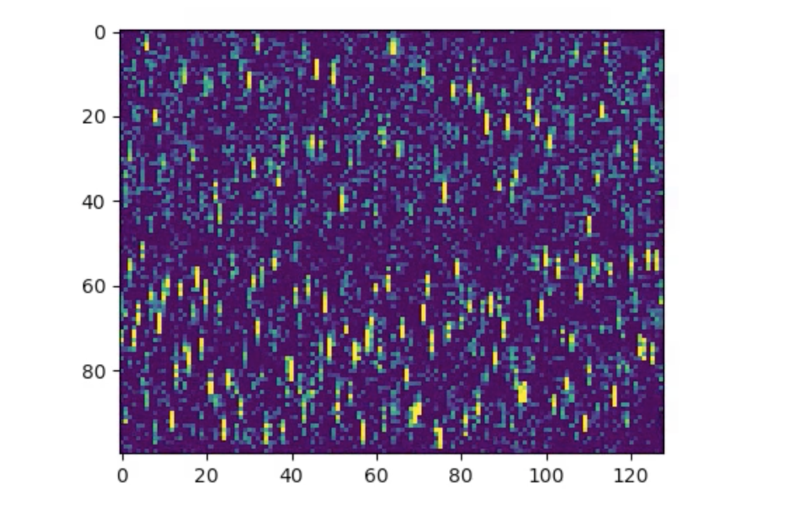

# The HTM Spatial Pooler as a Hopfield network

 - **Brief overview** (probably still unfinished) of the approach: `notes.md` (best viewed with a with viewer that displays math equations)
 - First **experimental results** can be found in: `jupyter/results/...`. Each folder contains experimental results for a particular setup, briefly described in the associated readme-file.

### How to interpret the images

##### Reconstruction

Each row shows an excerpt of a binary vector. The first 50 bits encode the x-coordinate, and the last 50 bits encode the y-coordinate.
The last 50 entries in each row are reapeted 2 times to form the full input vector (i.e. the actual length of the vectors is 100 + 2*50 = 200).

 - Right: 25 test input vectors.
 - Left: Reconstruction of the corresponding input on the right.

##### Scatter

Each point corresponds to a learned feature (i.e. a row in the weight matrix W encoding the visible-to-hidden connections).

- x-coordinate: sum of the weights of connections to the first 50 input units
- y-coordinate: sum of the weights of connections to the last 150 input units

##### Learned features

Each column corresponds to a learned feature (i.e. a row in the weight matrix W encoding the visible-to-hidden connections).

...

