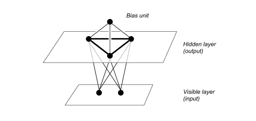

# The HTM Spatial Pooler as a Hopfield network

The aim is to express Numenta’s spatial pooler as a Hopfield network. In order to do so we have to express the w-max-overlap procedure as an appropriate energy function. This enables us to extend the energy by an additional term to decorrelate pairwise column activity similar to P. Flödiák’s approach in his 1990’s paper.
Relevant keywords are: Hopfield networks, Boltzmann machines, Energy based models, Local anti-Hebbian learning by Flödiák. See the references for relevant and more sources.

 - The **new pooler** is implemented as `EnergyBasedPooler` in `energy_based_models/energy_based_pooler.py`. 
 - **Brief overview** (still unfinished) of the approach: `latex/notes.pdf` 
 - First **experimental results** can be found in: `jupyter/results/`. Each folder contains experimental results for a particular setup, briefly described in the associated readme file.
 -  The module also contains an implementation of the approach described in Földiák's paper. A re-run of the "bars experiment" can be found in the notebook `jupyter/Foldiak\ --\ bars.ipynb`.


<p align="center"></p>


# References and Relevant sources:

 - P. Földiák, *Forming sparse representations by local anti-Hebbian learning*, Biological Cybernetics 64 (1990), 165–170.
 - Yuwei Cui, Subutai Ahmad, and Jeff Hawkins, *The HTM Spatial Pooler: a neocortical algorithm for online sparse distributed coding*, bioRxiv:085035 (2017).
 - John J. Hopfield, <http://www.scholarpedia.org/article/Hopfield_network>


# First observations

#### 1. Ordinary Boosting *vs.* Extended Boosting

Compare *ordinary boosting*
with *extended boosting* decorrelating activity:

```
open jupyter/results/three-to-one__non_extended/reconstruction.mp4
open jupyter/results/three-to-one__extended/reconstruction.mp4
```

Additionally, compare to initialization with *normalized* random weights (i.e. each row in W is scaled to have unit norm when initialized):

```
open jupyter/results/three-to-one__extended__normalized/reconstruction.mp4
```

#### 2. Without size penalty

Remove the size penalty from the energy, then compare results for E with *extended boosting/inhibition* 
to E with *extended inhibition only* (i.e. ensure non-negative H)

```
open jupyter/results/three-to-one__no_size_peanlty__b5sj/reconstruction.mp4
open jupyter/results/three-to-one__zero_bound__no_size_penalty__ibAj/reconstruction.mp4

```

