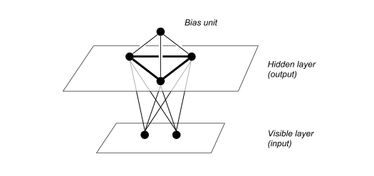

# The HTM Spatial Pooler as a Hopfield network
<!--An Energy-Based Spatial Pooler-->

These are **unfinished** notes!

The goal is to express the spatial pooler as a Hopfield network,
and extend its boosting procedure.
Relevant keywords are:

 - Hopfield networks,
 - Boltzmann machines,
 - Energy based models,
 - Local anti-Hebbian learning by Földiák [[Foldiak]](#foldiak)

 See the [references](#references) for relevant and more sources...

### Network architecture

Let $m$ and $n$ be the number of visible and hidden units respectively.
Furthermore we add a single bias unit, and connect all the units as follows.

 - **Visible-to-hidden** connections encoded by an $(n \times m)$-matrix $W$.
 - **Hidden-to-hidden** connections encoded by an $(n \times n)$-matrix $H$.
 (For the original spatial pooling algorithm these connections are zero.)
 All hidden-to-hidden connections are symmetric without self connections,
 i.e. we have $h_{ji} = h_{ji}$, and $h_{ii} = 0$ for any $i,j$.
 - **Bias-to-hidden** connections encoded by a vector $b$ of size $n$

### Weight updates

After each mini-batch the weights are updated and computed as follows:
The visible-to-hidden connections are updated according to
a Hebbian update rule as described in [[HTMsp]](#sp_paper)

$$
	\Delta w_{ij} = y_i \cdot  ( \varepsilon_+ \ x_j - \varepsilon_- \ \bar x_j )
$$

After any update the visible-to-hidden connections are clipped to be between $0$ and $1$:

$$
\begin{eqnarray*}
   &w_{ij} := 0& \text{ if } w_{ij} < 0 , \text{ and} \\
   &w_{ij} := 1& \text{ if } w_{ij} = 1.
\end{eqnarray*}
$$

The remaining connections - hidden-to-hidden and bias-to-hidden -
are determined by the average activity of the hidden units.
Let $\alpha_i$ denote the average activity of an individual unit $y_i$
(estimated by using an exponentially decaying average of the mean probability
  that a unit is active in each mini batch) then the weights of the bias
  connections are given by

$$
  b_{i}  = B_b \cdot \alpha_i.
$$

Similar to the *individual* average activity defined above we define
the average *pairwise* activity $\alpha_{ij}$ of two units $i$ and $j$.
With this in hand we set the hidden-to-hidden connections are given by

$$
  H_{ij} = B_H \cdot ( \alpha_{ij} - \alpha_i \ \alpha_j ) \ \text{ and } \  H_{ii} = 0.
$$

Here $B_b$ and $B_H$ are two non-negative factors
referred to as **boosting strength**.

### Energy function

A straight-forward candidate for an energy function resembling the behaviour of the spatial pooler is

$$
   E(x,y) = - \sum_{i=1}^n
        y_i
        \cdot
        \underbrace{
        \exp\Big( - b_i\cdot y_0 \ -  \sum_{j=1}^n h_{ij} \cdot y_j \Big)
        }_{\textit{"boosting"}}
        \cdot
        \underbrace{
        \Big(\sum_{j=1}^m w_{ij}\cdot x_j \Big)  
        }_{\textit{"overlap"}}
        \ + \  
        S(y)
$$

Here $S(y)$ denotes a *size-penalty* (or *size-bound*) forcing the weight of the vectors
to be in a predefined desired range. For instance we could use something
along the lines of

$$
S(y) = \begin{cases}
            0  &  \text{if} \ \|y\| \leq w \ \text{, and} \\
      +\infty  &  \text{otherwise,}
    \end{cases}
$$

where $w$ is a previously desired *code weight*
(that is, the number of active bits).

### Encoding inputs

The energy function $E$ defines a binary encoder by

$$
    \phi\colon \  x \mapsto \mathop{\arg\min}_y E(x,y).
$$

Note that the encoder associated with the above energy function does indeed extend
the original *spatial pooling procedure*:
if we assume all the hidden-to-hidden connections to be zero,
the above energy function does activate the units with the $w$-topmost *boosted overlap scores*.
Note that in practice it is not feasible to compute the actual minimum,
and we have to settle with the fact that we might only get to a local minimum.

# Questions

 **What's the energy gap here?** ...see snippets

 **What is the right way of finding an energy minimum?**

 Because the visible- to-hidden connections are clipped to be between 0 and 1 the overlap scores are all positive. Further more the boosting term is also positive. Hence we are dealing with a special dynamic: assume $H \equiv 0$, and a uniform $b$, then the “radial direction” in $\{0,1\}^n$  is “gradient-like” for $E(x,.)$. In consequence if we start with a random $y$ of weight $w$ and do hill descend with neighbors at Hamming distance $1$ we are stuck. Note that if we start the hill descend at zero, and move in the direction of steepest descend, we end up with the $w$-topmost overlap scores. Alternatively we might add neighbours with the same weight at distance $2$, that is, allowing to switch an active unit off and an inactive one on.

# References and Relevant sources

<a name="foldiak">\[Foldiak\]</a> P. Földiák, Forming sparse representations by local anti-Hebbian learning, Biological Cy- bernetics 64 (1990), 165–170.

<a name="sp_paper">\[HTMsp\]</a> Yuwei Cui, Subutai Ahmad, and Jeff Hawkins, The HTM Spatial Pooler: a neocortical algorithm for online sparse distributed coding, bioRxiv:085035 (2017).

<a name="scholarpedia">\[Scholarpedia\]</a> [Hopfield_network](http://www.scholarpedia.org/article/Hopfield_network)
