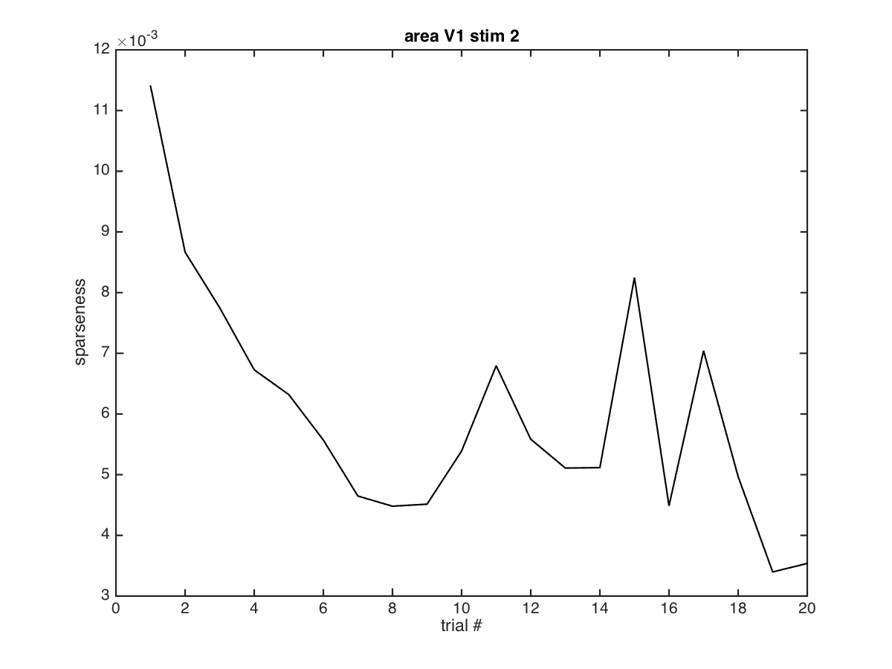
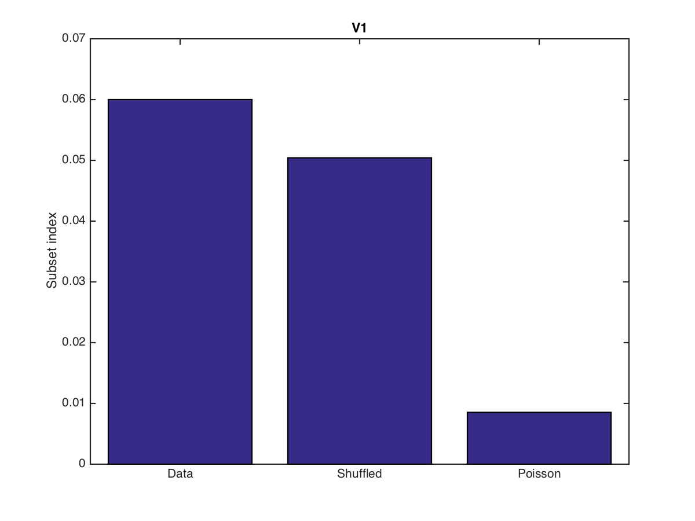
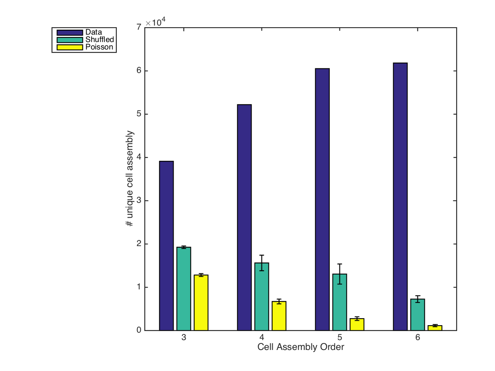
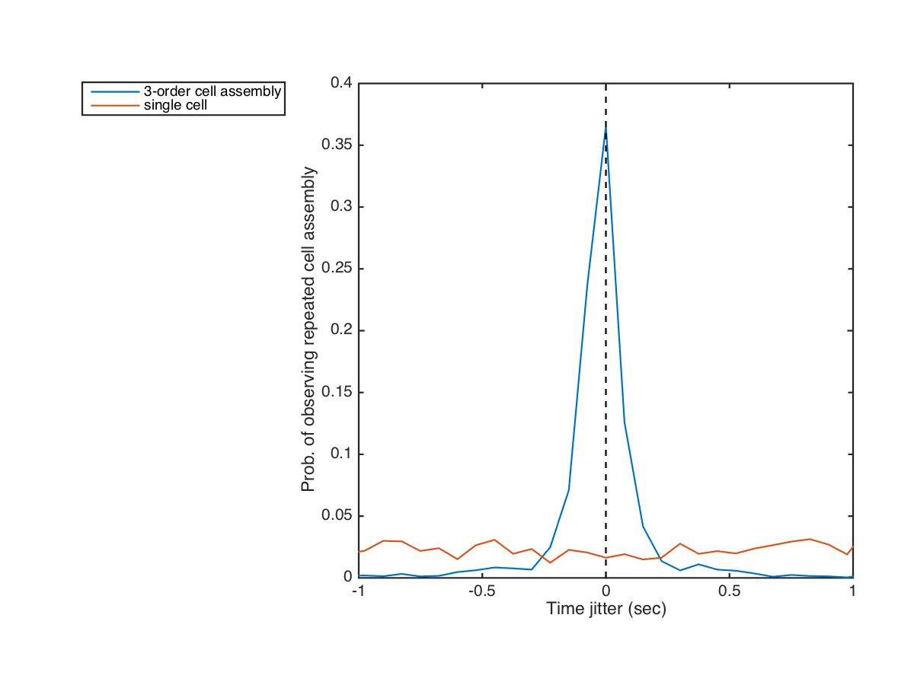
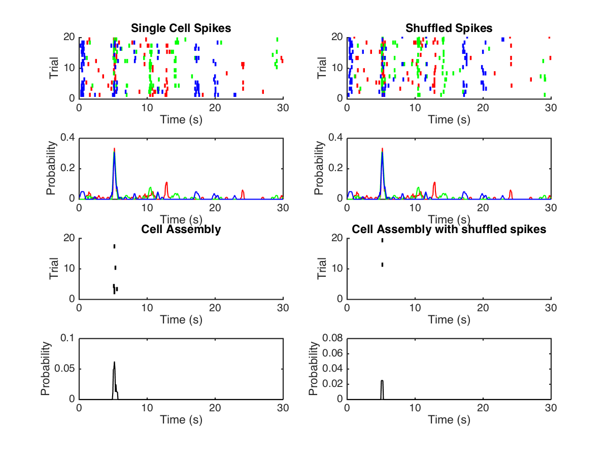

# Description

This repository contains scripts that demonstrates presence of high-order cell assemblies from wide-field calcium imaging data. This is a collabo.pngrative project with[ Prof. Spencer Smith](http://slslab.org/) and Dr. Yiyi Yu from University of North Carolina, Chapel Hill. Part of the results has been presented at [the 3rd International Conference on Mathematical Neuroscience](https://www.math.uh.edu/~zpkilpat/icmns2017/index.html). The conference submission and presentation can be found in `icmns_submission`

# Data preprocessing

Run the script `combine_dataset.m ` to pre-process the data. The data should be stored in the `data/` directory. Each directory contains a different experiment. For each experiment, there are simultaneous recording from the primary visual cortex (V1, Combo3_V1.mat) and a higher visual cortex (area AL, Combo3_AL.mat).

These files can be opened via Matlab, or using the [mat4py library](https://pypi.python.org/pypi/mat4py/0.1.0).

# Decrease sparsity over trials

Run the script `sparsity_over_trial.m` to see the decreasing sparsity across repeated trials. You can change the `area` variable to see the result for `V1` or `AL`. The summary plots will be saved in `figures/sparsity/`. Below is an example result for area AL.

# Presence of high-order cell assemblies

Run the script `analyze_data_populaiton.m` to see evidence of high-order cell assemblies. The script will generate the following result for each experiment session

* sparsity over trial (figures/sparseness_over_time_stim_*, Fig. 1C)

* subset index calculation (figures/subset_index_stim_* Fig. 1D)

* Number of unique high-order cell assemblies (cellAssembly_* Fig. 1E)

* Accuracy of cell assembly occurance time (cellAssembly_jitter_*, Fig. 1F)

* Example raster plots (figures/exampleRaster_Stim_* slide #27)

