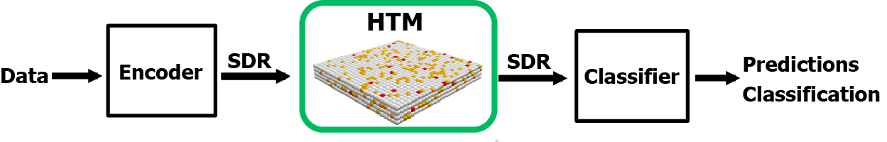
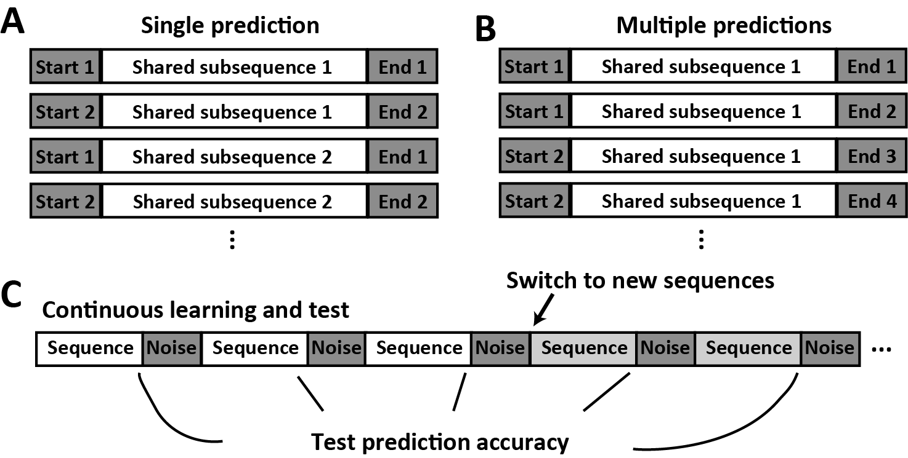
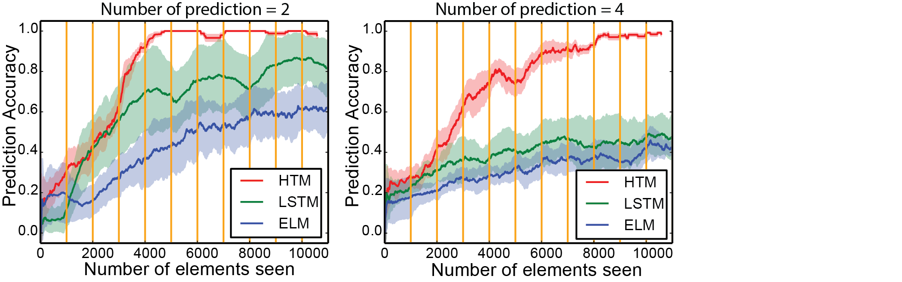
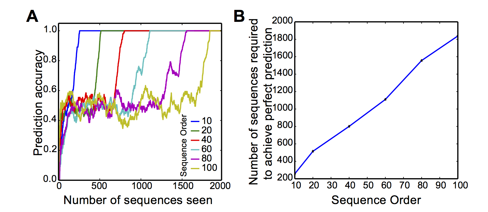
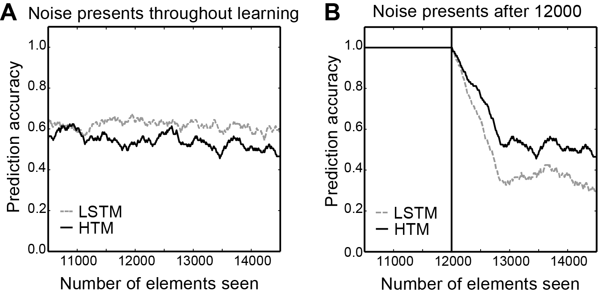
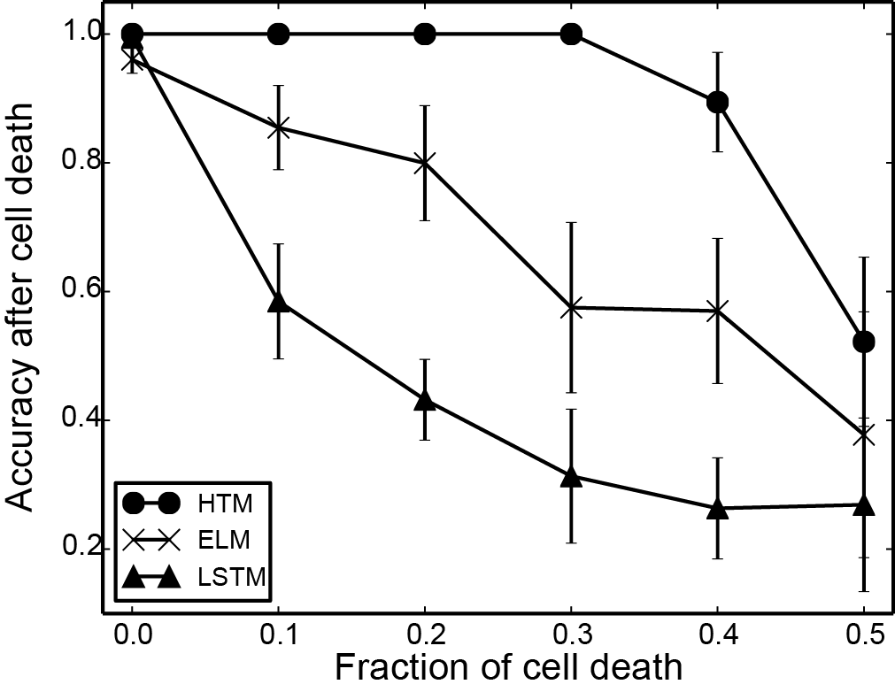
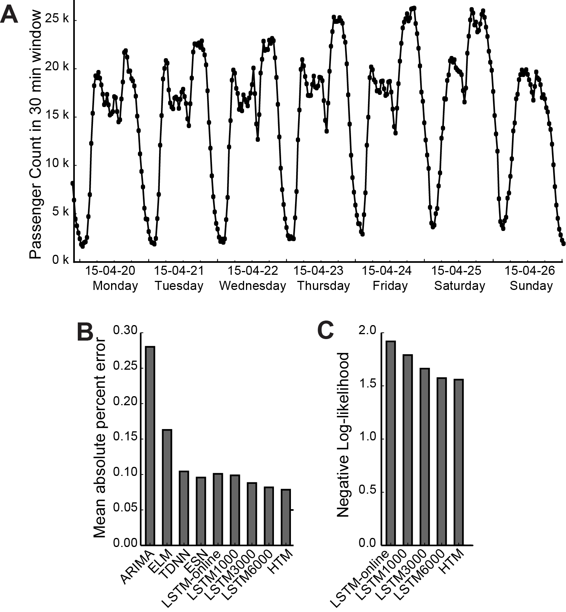
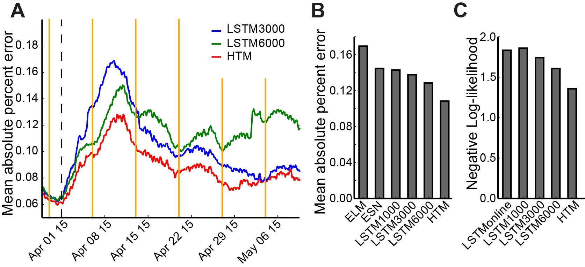

# Description

This directory contains Python scripts that compare HTM with other 
algorithms on standard sequence prediction problems, including 
both discrete sequence prediction tasks, and continuous time-series
prediction tasks. The results are published in the following paper:
 
Cui Y, Ahmad S, Hawkins J. Continuous online sequence learning with an unsupervised neural network model. (2016) *Neural Computation,* 28(11) 2474-2504.  DOI: 10.1162/NECO_a_00893

# Dependency
* NuPIC (required for all experiments)
* SciPy
* [PyBrain](https://github.com/pybrain/pybrain) required for LSTM and TDNN
* R (required for ARIMA algorithm) (Fig. 10, 11)
* [hpelm](https://pypi.python.org/pypi/hpelm/1.0.4) required for experiments with Extreme Learning Machine
* [ESNToolbox](http://reservoir-computing.org/node/129) required for Echo State Networks (Fig 10, 11)

# Sequence prediction of HTM
HTM can be used for online sequence prediction tasks. The figure below shows the general setup. A data stream is first encoded into sparse distributed representations (SDRs) with an encoder. The HTM sequence memory is able to learn temporal transitions of SDRs. Predictions or classifications can then be decoded from the active cells using a SDRClassifier.

# Discrete sequence prediction
We compared HTM, LSTM, ELM and TDNN on the task of high-order sequence prediction. The data stream consists of sequences with shared subsequences. It is necessary to maintain a context of the starting element to correctly predict the ending elements. Sequences are presented in a continuously online fashion, with noise elements inserted between sequences. The dataset is implemented [here](https://github.com/numenta/nupic.research/blob/master/htmresearch/support/sequence_prediction_dataset.py).

The prediction accuracy as a function of training is shown in the figure below. We switched to a different set of sequences at step 10000.  

The results can be reproduced using scripts in `./discrete_sequences/` For example, to reproduce the result of HTM, run

	cd discrete_sequences/{tm|lstm|elm|tdnn}/
	python suite.py -e high-order-distributed-random-perturbed

The required experiment name for tm, elm and lstm is `high-order-distributed-random-perturbed`

The required experiment names for tdnn are `high-order-distributed-random-perturbed`, `high-order-distributed-random-perturbed-long-window` and `high-order-distributed-random-perturbed-short-window`

The results will be saved to `results/high-order-distributed-random-perturbed` and can be visualized with the script `plotPerturbExperiment.py` (single trial) or `plotRepeatedPerturbExperiment.py` (multiple repeats with error bars)

If you need to use domino, you can run the TM experiments from htmresearch/ with
`domino run projects/sequence_prediction/discrete_sequences/tm/suite.py -c projects/sequence_prediction/discrete_sequences/tm/experiments.cfg -e high-order-distributed-random-perturbed`

# Properties of HTM sequence memory
We have designed a set of experiments to illustrate properties of HTM. These experiments are variations of the discrete sequence learning task.

## Multiple predictions
In this experiment, each high-order sequence has two or four possible endings. Due to the use of SDRs, HTM is capable to represent multiple predictions internally, as a union of multiple SDRs. However, it is much harder to do that with dense representations. The figure below shows the prediction accuracy over training for HTM and LSTM and ELM. To reproduce the results for HTM, run

	cd discrete_sequences/{tm|lstm|elm}/
	python suite.py -e high-order-distributed-random-multiple-predictions

The results can be visualized with the script `plotMultiplePredictionWithErrBar.py`

## Learning sequences of different orders
Here we tested whether HTM sequence memory can learn long-term dependencies by varying the Markov order of the sequences, which is determined by the length of shared sub-sequences.

To reproduce this experiment, run
	cd discrete_sequences/tm/
	python suite.py -e high-order-variable-length

The results can be visualized with the script `plotSequenceLengthExperiment.py`

## Sensitivity to temporal noise
We evaluated the sensitivity to temporal noise that is inserted in the middle of high-order sequences in this experiment. Such temporal noise can disrupt contextual information in both HTM and LSTM networks. The figure below shows that the networks are unable to learn high-order sequences if temporal noise present during learning (left), and will have worse performance if temporal noise is inserted after learning (right)

To reproduce this experiment for HTM, run

	cd discrete_sequences/{tm|lstm}/
	python suite.py -e high-order-noise
The results can be visualized with the script `plotNoiseExperiment.py`

## Fault Tolerance
Because of the use of sparse distributed representations, HTM sequence memory is tolerant to system faults such as cell death or synapse loss. In this experiment, we killed a fraction of the cells after the model achieves perfect performance on a sequence prediction task, and monitored how prediction accuracy is affected by the system faults. The results are shown below.

To reproduce this experiment, run

	cd discrete_sequences/{tm|lstm|elm}/
	python suite.py -e high-order-distributed-random-kill-cell
	
The results can be visualized with the script `plotFaultyTMPerformance.py`

# Continuous time series prediction

We considered the task of predicting taxi demand in the New York City as an example.  The figure below shows a short segment of the data (top). The performance of various techniques is shown in the lower panel. 

The detailed instructions to run experiments with the continuous time series prediction task can be found in `./continuous_sequence/`. For example, to run HTM on this task, 

	cd continuous_sequence/
	
	
TM:	
`python run_tm_model.py -d nyc_taxi`

LSTM: 
Run the following experiments:
`python run_lstm_suite.py -e  nyc_taxi_experiment_continuous`
`python run_lstm_suite.py -e nyc_taxi_experiment_continuous_likelihood`
`python run_lstm_suite.py -e nyc_taxi_experiment_continuous_likelihood_online`

ELM: `python run_elm.py -d nyc_taxi`

ESN: in Matlab, run `run_esn_model.m`, set `injectPerturbation` to 0 on line 28

ARIMA: in R, run `run_arima.R`

Adaptive Filter, run `run_adaptive_filter.py`

The results can be visualized with the script `plotPerformance.py`

We are able to show that HTM can adapt changes quickly due to its ability to learn continuously. In the figure below, we plotted prediction error after an artificial manipulation of data, which involves increasing night taxi demand and decreasing morning taxi demand. The HTM sequence memory is able to pick up the new pattern quickly.

This result can be reproduced with

	cd continuous_sequence/
	
TM: `python run_tm_model.py -d nyc_taxi_perturb`

LSTM: 
Run the following experiments:
`python run_lstm_suite.py -e  nyc_taxi_experiment_continuous_likelihood_perturb`
`python run_lstm_suite.py -e nyc_taxi_experiment_continuous_likelihood_perturb_online`
`python run_lstm_suite.py -e  nyc_taxi_experiment_continuous_perturb`
`python run_lstm_suite.py -e nyc_taxi_experiment_continuous_perturb_online`

ESN: in Matlab, run `run_esn_model.m`, set `injectPerturbation` to 1 on line 28

and visualized with the plotting script `plotPerturbResult.py`